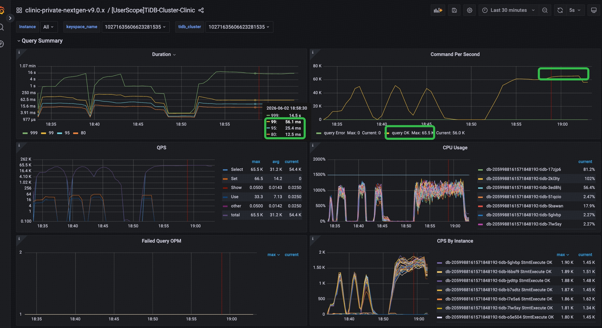

# Intuit TiDB Performance Support Bundle

Lean internal bundle for Hua/Jinlong/TSE review. This contains only the files needed to recreate the final demo build, validate the data/pre-agg tables, and run the benchmark using whole-number events/sec.

This bundle intentionally excludes older experiment helpers and the separate `run_qps_ladder.py` harness. The benchmark runner is the same event/sec harness used for the demo.

## Contents

- `code/`: runnable scripts with the same layout as the working repo.
- `code/generate_go_workload.py`: materializes the 65-bundle event workload for the Go load generator.
- `code/go-loadgen/`: high-concurrency Go client used to remove Python/GIL/future scheduling from capacity tests.
- `code/run_go_loadgen_fleet.py`: optional SSH fan-out runner for multiple EC2 client machines.
- `connection/.db_config.json`: local Premium connection config when present; ignored by git.
- `docs/`: v15 runbook and audit notes.
- `results_reference/current_schema_ddl.sql`: current DDL for 2 base tables + 6 pre-agg tables.
- `results_reference/current_tiflash_status.txt`: current TiFlash replica status.
- `results_reference/diag_200qps_mixed_traffic_1780002101.json`: latest 200-QPS-equivalent diagnostic result.

## Current Physical Design

- Base tables:
  - `pmt_txn_fact`
  - `deviceprofile_fact`
- Layout:
  - monthly partitioning
  - `SHARD_ROW_ID_BITS=4`
  - `PRE_SPLIT_REGIONS=3`
- Optimized covering indexes:
  - runtime payment indexes for merchant/card/routing/join paths
  - runtime device indexes for exact/smart/input/true IP paths
  - Group C payment-side covering join indexes for merchant/card/routing-account paths
- 180d pre-agg tables:
  - `group_a_180d_daily_rollup`
  - `group_a_180d_daily_distinct`
  - `group_b_180d_daily_rollup`
  - `group_b_180d_daily_distinct`
  - `group_c_180d_daily_rollup`
  - `group_c_180d_daily_distinct`
- TiFlash status at export time:
  - base tables enabled and synced
  - pre-agg tables TiKV-only

## Workload

- 1 event = 65 independent bundle queries. They share the same event bindings/reference time and can fan out in parallel; scoring waits for the combined fan-in result.
- Runtime-only windows: `1d`, `7d`, `30d`, `90d`.
- `180d` windows use the 6 consolidated pre-agg tables.
- Group C runtime joins include timestamp filters on both tables.
- Python mixed-benchmark per-query cutoff: `READ_MAX_EXECUTION_TIME_MS=500`.
  The Go fleet SLA runs below use `--max-execution-time-ms 0` and calculate
  350ms/500ms SLA from observed completion times instead of killing queries.
- Background writes are enabled by default in the mixed benchmark.

## Event QPS Target

The final SLA is stated in event QPS. The benchmark accepts events/sec and
issues 65 bundled SQLs for every event.

| Target | Events/sec | Bundle SQL/sec |
| --- | ---: | ---: |
| Normal | 100 | 6,500 |
| Peak | 1000 | 65,000 |

Formula: `bundle_sql_per_sec = events/sec * 65`.

## Setup

```bash
cd code
cp ../connection/.db_config.json .db_config.json
python3 -m py_compile *.py lib/*.py
ulimit -n 200000
```

For an already-built database, this safely applies any missing optimized
covering indexes:

```bash
python3 apply_optimized_indexes.py --execute
```

## Full Build

Warning: this drops/recreates the base tables in the configured database.

```bash
cd code
cp ../connection/.db_config.json .db_config.json
./run_v15_full_monthly_premium_build.sh
```

This runs:

1. `setup_schema.py`
2. full data load
3. `enable_tiflash.py`
4. `analyze_tables.py`
5. `verify_partitioning.py`
6. `profile_validation.py`
7. `run_prod_180d_preagg_parallel.sh`

## Correctness Gates

```bash
cd code
cp ../connection/.db_config.json .db_config.json
./run_prod180_correctness_gates.sh
```

This checks:

- Python compile
- pre-agg structural/data coverage
- raw-vs-preagg exact-result spotchecks

## Reusable Event Sample

Use this to avoid benchmarking event sampling/hot-key discovery:

```bash
cd code
cp ../connection/.db_config.json .db_config.json
python3 build_reuse_events_from_stats.py \
  --normal-events 11000 \
  --hot-events-per-field 100 \
  --output results/reuse_events_hua_fullscale.json
```

## Run Benchmark

200-QPS equivalent:

```bash
cd code
cp ../connection/.db_config.json .db_config.json
ulimit -n 200000
export READ_MAX_EXECUTION_TIME_MS=500
export TIDB_ISOLATION_READ_ENGINES=tikv,tidb
export INTUIT_FORCE_INLINE_CTE=0
export REUSE_EVENTS_JSON=results/reuse_events_hua_fullscale.json
export SUMMARY_ONLY=1
export POOL_SIZE=256
export BUNDLE_WORKERS=256
export EVENT_WORKERS=32
export MAX_PENDING_EVENTS=16
./run_v15_prod180_benchmark.sh 3 300
```

The benchmark wrapper now defaults to the optimized prod180 path:

- `PREAGG_LAYOUT=prod180`
- 180d bundles only use the consolidated pre-agg tables
- read sessions use `tidb_isolation_read_engines='tikv,tidb'`
- `tidb_opt_force_inline_cte=0`
- runtime SQL omits redundant `GROUP BY` when the group key is already fixed by equality predicates

Other event rates:

```bash
./run_v15_prod180_benchmark.sh 100 300
./run_v15_prod180_benchmark.sh 1000 300
```

Per Hua's request, stop if average latency exceeds `1s`.

## Go Load Generator

Use the Go load generator for high-concurrency capacity tests of the 65
independent SQLs per event. The Python benchmark is still useful for functional
validation and detailed per-bundle diagnostics, but the Go path is the current
load-test path because it removes Python/GIL/future scheduling from the hot
path.

Current official mode for fleet tests:

- `--execution-mode event-fanout`
- 1 event submits all 65 bundle SQLs concurrently.
- The Go process uses a prewarmed `database/sql` pool with long-lived TiDB
  connections.
- `MaxOpenConns` and `MaxIdleConns` are both set from `--connections`.
- `--prepare-all` prepares all 65 SQL templates before the timed window.
- `--target-event-eps` plus `--duration` creates a steady-rate test instead of
  one burst batch.
- `--max-execution-time-ms 0`, `--read-timeout 0s`, and `--query-timeout 0s`
  are used for SLA validation. Do not kill tail SQLs during the main run; use
  the output summaries to calculate 350ms/500ms SLA. Cutoff tests are useful for
  fallback experiments but they can create `Failed Query OPM` noise.

### 1. Generate a Static Workload

Generate the static Go workload from the optimized prod180 path. This keeps
`1d`, `7d`, `30d`, and `90d` windows on the base tables and uses the 180d
prod180 pre-agg tables for the 180d features.

```bash
cd code
cp ../connection/.db_config.json .db_config.json

.venv/bin/python generate_go_workload.py \
  --reuse-events-json results/mixed_traffic_1780349424.json \
  --output results/go_workload_1000_hybrid_prod180_180d_serving_wide_paramwin.json \
  --events 1000 \
  --hot-event-pct 0.05 \
  --preagg-mode hybrid \
  --preagg-layout prod180 \
  --serving-as-of-grain day \
  --runtime-window-params
```

This writes one JSON file containing the rendered SQL templates and
event-specific parameters for `1000 * 65` bundle executions. The Go hot path
does not import Python or render SQL.

For sustained capacity probes, `--events` on the Go client may be larger than
the generated event sample; the client cycles through the static sample by
event index.  Use this to keep the database under load long enough to inspect
dashboard and processlist behavior.

### 2. Build the Go Client

Build locally for the current machine:

```bash
cd code/go-loadgen
go mod tidy
go build -o go-loadgen .
```

Build a Linux binary for EC2:

```bash
cd code/go-loadgen
GOOS=linux GOARCH=amd64 go build -o go-loadgen-linux-amd64 .
```

### 3. Copy to an EC2 Client

If the bundle is already on the EC2 client, only copy the refreshed files:

```bash
REMOTE=ec2-user@ec2-44-242-164-82.us-west-2.compute.amazonaws.com
KEY=/path/to/rp-us-west-2.pem

ssh -i "$KEY" -o StrictHostKeyChecking=no "$REMOTE" \
  'mkdir -p ~/tidb_intuit_perf_support_bundle_lean/code/go-loadgen ~/tidb_intuit_perf_support_bundle_lean/code/results'

scp -i "$KEY" -o StrictHostKeyChecking=no \
  code/go-loadgen/go-loadgen-linux-amd64 \
  "$REMOTE":~/tidb_intuit_perf_support_bundle_lean/code/go-loadgen/

scp -i "$KEY" -o StrictHostKeyChecking=no \
  code/results/go_workload_1000_hybrid_prod180_180d_serving_wide_paramwin.json \
  "$REMOTE":~/tidb_intuit_perf_support_bundle_lean/code/results/
```

Make sure the EC2 client also has `code/.db_config.json`.

### 4. Single-Host Smoke Run

Use this only to verify that the binary, workload JSON, and database config are
valid. It is not a peak-capacity test.

```bash
cd ~/tidb_intuit_perf_support_bundle_lean/code
ulimit -n 30000

./go-loadgen/go-loadgen-linux-amd64 \
  --workload results/go_workload_1000_hybrid_prod180_180d_serving_wide_paramwin.json \
  --db-config .db_config.json \
  --output results/go_loadgen_smoke_100e_200c_eventfanout.json \
  --events 1000 \
  --connections 200 \
  --read-timeout 0s \
  --query-timeout 0s \
  --max-execution-time-ms 0 \
  --execution-mode event-fanout \
  --prepare-all
```

### 5. Multi-EC2 Fleet Run

Use the fleet runner when testing 1000 events/sec. Each remote host must already
have:

- `~/tidb_intuit_perf_support_bundle_lean/code/go-loadgen/go-loadgen-linux-amd64`
- `~/tidb_intuit_perf_support_bundle_lean/code/results/go_workload_1000_hybrid_prod180_180d_serving_wide_paramwin.json`
- `~/tidb_intuit_perf_support_bundle_lean/code/.db_config.json`

Create a host file with one EC2 client per line. The June 2 run used 8 EC2
client instances in us-west-2:

```bash
cat >/tmp/codex_go_hosts8.txt <<'HOSTS'
ec2-user@ec2-44-242-164-82.us-west-2.compute.amazonaws.com
ec2-user@ec2-34-221-242-8.us-west-2.compute.amazonaws.com
ec2-user@ec2-35-90-177-174.us-west-2.compute.amazonaws.com
ec2-user@ec2-16-146-95-202.us-west-2.compute.amazonaws.com
ec2-user@ec2-52-26-112-220.us-west-2.compute.amazonaws.com
ec2-user@ec2-34-209-224-219.us-west-2.compute.amazonaws.com
ec2-user@ec2-52-34-156-58.us-west-2.compute.amazonaws.com
ec2-user@ec2-44-251-142-242.us-west-2.compute.amazonaws.com
HOSTS
```

Run from the repo root:

```bash
prefix="go_fleet16_8host_eventfanout_1000eps_3000c_600s_no_maxexec_$(date +%s)"

python3 code/run_go_loadgen_fleet.py \
  --hosts "$(paste -sd, /tmp/codex_go_hosts8.txt)" \
  --ssh-key /path/to/rp-us-west-2.pem \
  --remote-dir '~/tidb_intuit_perf_support_bundle_lean/code' \
  --workload results/go_workload_1000_hybrid_prod180_180d_serving_wide_paramwin.json \
  --db-config .db_config.json \
  --events-total 1000000 \
  --connections-total 3000 \
  --processes-per-host 2 \
  --setup-timeout 1200s \
  --read-timeout 0s \
  --query-timeout 0s \
  --max-execution-time-ms 0 \
  --execution-mode event-fanout \
  --target-event-eps 1000 \
  --duration 600s \
  --max-pending-events 3000 \
  --start-delay-seconds 30 \
  --prepare-all \
  --output-prefix "$prefix" | tee "results/${prefix}.log"
```

This layout means:

- 8 EC2 client instances
- 2 Go processes per EC2 instance, so 16 load-generator app processes
- target `1000 events/sec / 16 = 62.5 events/sec` per app process
- 65 SQLs per event, so target `65,000 SQL/sec` total
- `3000` requested connections total; the runner rounded this to `188`
  connections per process, or about `3008` pool slots total
- the 10-minute run reported `Workers ready=186-188/188` per process

### 6. How to Read Results

The Go output prints and stores these key summaries:

- `Workers ready=X/Y`: number of connections fully opened and session-configured
  before the timed run starts.
- `completed_eps`: events completed, including events with query errors.
- `full65_eps`: events where all 65 bundle SQLs succeeded.
- Primary SLA EPS: events where `full_65_of_65 <= 350ms`.
- Fallback SLA EPS: events where `score_ready_60_of_65 <= 500ms`.
- `event_completion`: wall time from event submission until all 65 bundle tasks
  finish.
- `full_65_of_65`: completion time only for events where every bundle succeeded.
- `score_ready_60_of_65`: completion time when at least 60 of 65 bundle SQLs
  have succeeded. This is the fallback SLA metric.
- `query_runtime`: time spent inside `stmt.QueryContext` plus result drain; this
  is the best proxy for database/service-path latency.
- `task_queue`: time waiting in the client task queue before a worker connection
  picked up the SQL.  If this is high while `query_runtime` is low, add client
  workers/connections.  If `query_runtime` rises under load, the bottleneck is no
  longer Python/client scheduling.

### 7. June 2 Fleet Results

These are reference results from the June 2, 2026 Go fleet runs; refresh them
after any cluster size, RCU, serving-table, TiDB node count, or client-location
change.

| Run | Result |
| --- | --- |
| 8 EC2 / 16 apps / 1000 connections / 1000 EPS / 120s | completed `830.88 EPS`, Primary `8.07 EPS`, Fallback `14.74 EPS`, errors `0` |
| 8 EC2 / 16 apps / 2000 connections / 1000 EPS / 90s | completed `878.61 EPS`, Primary `183.15 EPS`, Fallback `287.16 EPS`, errors `0` |
| 8 EC2 / 16 apps / 3000 connections / 1000 EPS / 90s | completed `914.55 EPS`, Primary `578.08 EPS`, Fallback `830.15 EPS`, errors `0` |
| 8 EC2 / 16 apps / 3000 connections / 1000 EPS / 600s | completed `942.19 EPS`, Primary `42.07 EPS`, Fallback `51.90 EPS`, errors `2` (`invalid connection`) |

The 3000-connection fleet run can drive the cluster into the intended steady
shape: roughly 65K SQL commands/sec for a 1000 events/sec workload with 65 SQLs
per event. The Grafana screenshot below shows the TiDB-side command/QPS plateau
during the steady phase, and the database-side query duration p99 is within the
target range.



At the highlighted steady-state cursor in the screenshot:

- TiDB `query OK` reached `65.5K` commands/sec max and was still around `56.0K`
  commands/sec at the cursor.
- TiDB `Select` reached `65.5K` QPS max and was around `54.4K` QPS at the cursor.
- TiDB-side duration was `p99=56.1ms`, `p95=25.4ms`, and `p80=12.5ms`.
- Failed query OPM stayed at `0` in this view.

Metric scope matters:

- Grafana is the database-side view. It shows the cluster can sustain the
  intended SQL-command shape and that SQL duration p99 is meeting the target in
  the observed steady window.
- Go loadgen JSON is the app/event fan-in view. Its `full_65_of_65` and
  `score_ready_60_of_65` numbers measure how fast each synthetic event sees all
  65, or 60 of 65, SQL responses return through the client. Use these numbers
  to analyze app-side scheduling/fan-in behavior; do not use them to contradict
  the database-side p99 shown by Grafana.

## Client-Side Diagnostics

The packaged `mixed_traffic_test.py` records:

- event-level fan-out capacity: target bundle SQL/sec, client bundle slots,
  and 350/500ms slot requirements
- bundle task queue average/max per event
- DB connection wait average/max per event

In the 200-QPS-equivalent diagnostic run:

- bundle task queue avg p95: `38.3ms`
- bundle task queue max p95: `72.8ms`
- DB connection wait avg/max: `0.0ms`

This indicates the app was not waiting on the connection pool and client queueing was small relative to event latency.

## Security Note

The git repository ignores `.db_config.json`. If a local exported bundle includes
credentials beside the repo, do not forward those files externally or to the customer.
