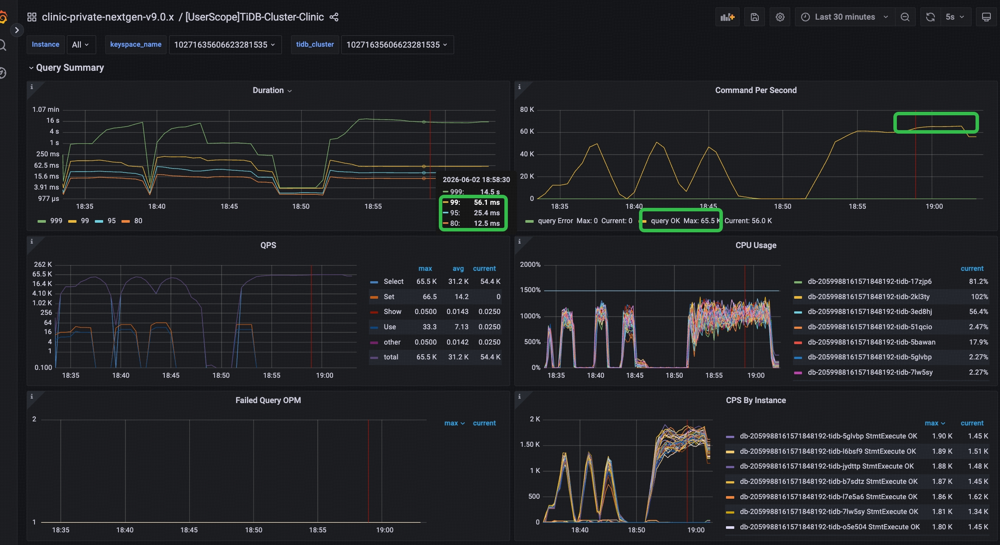

# TiDB Performance Support Bundle

Lean performance-support bundle for review. This contains only the files needed
to recreate the final demo build, validate the data/pre-agg tables, and run the
benchmark using whole-number events/sec.

This bundle intentionally excludes older experiment helpers and the separate `run_qps_ladder.py` harness. The benchmark runner is the same event/sec harness used for the demo.

## Contents

- `code/`: runnable scripts with the same layout as the working repo.
- `code/generate_go_workload.py`: materializes the 65-bundle event workload for the Go load generator.
- `code/go-loadgen/`: high-concurrency Go client used to remove Python/GIL/future scheduling from capacity tests.
- `code/run_go_loadgen_fleet.py`: optional SSH fan-out runner for multiple EC2 client machines.
- `connection/.db_config.json`: local Premium connection config when present; ignored by git.
- `docs/`: v15 runbook and audit notes.
- `results_reference/current_schema_ddl.sql`: current DDL for 2 base tables + 6 pre-agg tables.
- `results_reference/current_tiflash_status.txt`: current TiFlash replica status.
- `results_reference/diag_200qps_mixed_traffic_1780002101.json`: latest 200-QPS-equivalent diagnostic result.

## Current Physical Design

- Base tables:
  - `pmt_txn_fact`
  - `deviceprofile_fact`
- Layout:
  - monthly partitioning
  - `SHARD_ROW_ID_BITS=4`
  - `PRE_SPLIT_REGIONS=3`
- Optimized covering indexes:
  - runtime payment indexes for merchant/card/routing/join paths
  - runtime device indexes for exact/smart/input/true IP paths
  - Group C payment-side covering join indexes for merchant/card/routing-account paths
- 180d pre-agg tables:
  - `group_a_180d_daily_rollup`
  - `group_a_180d_daily_distinct`
  - `group_b_180d_daily_rollup`
  - `group_b_180d_daily_distinct`
  - `group_c_180d_daily_rollup`
  - `group_c_180d_daily_distinct`
- TiFlash status at export time:
  - base tables enabled and synced
  - pre-agg tables TiKV-only

## Workload

- 1 event = 65 independent bundle queries. They share the same event bindings/reference time and can fan out in parallel; scoring waits for the combined fan-in result.
- Runtime-only windows: `1d`, `7d`, `30d`, `90d`.
- `180d` windows use the 6 consolidated pre-agg tables.
- Group C runtime joins include timestamp filters on both tables.
- Python mixed-benchmark per-query cutoff: `READ_MAX_EXECUTION_TIME_MS=500`.
  The Go fleet SLA runs below use `--max-execution-time-ms 0` and calculate
  300ms/350ms/500ms SLA from observed completion times instead of killing
  queries.
- Background writes are enabled by default in the mixed benchmark.

## Event QPS Target

The final SLA is stated in event QPS. The benchmark accepts events/sec and
issues 65 bundled SQLs for every event.

| Target | Events/sec | Bundle SQL/sec |
| --- | ---: | ---: |
| Normal | 100 | 6,500 |
| Peak | 1000 | 65,000 |

Formula: `bundle_sql_per_sec = events/sec * 65`.

## Reference Fleet Snapshot

The database-side screenshot below is from the steady phase of the 8-client Go
fleet test. The run shape was:

- 8 EC2 client instances
- 2 Go load-generator app processes per EC2 instance, 16 app processes total
- 3000 requested database connections total; the runner rounded this to about
  188 connections per app process, or roughly 3008 pool slots total
- target `1000 events/sec`, with `65` independent bundle SQLs per event
- target SQL command shape: about `65,000` bundle SQL executions/sec
- long-lived connections with prepared statements, using `--execution-mode
  conn-fanout`, `--prepare-all`, and `--max-execution-time-ms 0`

The screenshot is a database-side reference for SQL-command throughput,
TiDB-side query duration, and cluster resource headroom during that run.



Metric scope matters:

- Grafana is the database-side view. Use it to confirm SQL-command throughput,
  TiDB-side query duration, and cluster resource headroom.
- Go loadgen JSON is the app/event fan-in view. Use `full_65_of_65` and
  `score_ready_60_of_65` to calculate event-level primary/fallback SLA.

## Setup

```bash
cd code
cp ../connection/.db_config.json .db_config.json
python3 -m py_compile *.py lib/*.py
ulimit -n 200000
```

For an already-built database, this safely applies any missing optimized
covering indexes:

```bash
python3 apply_optimized_indexes.py --execute
```

## Full Build

Warning: this drops/recreates the base tables in the configured database.

```bash
cd code
cp ../connection/.db_config.json .db_config.json
./run_v15_full_monthly_premium_build.sh
```

This runs:

1. `setup_schema.py`
2. full data load
3. `enable_tiflash.py`
4. `analyze_tables.py`
5. `verify_partitioning.py`
6. `profile_validation.py`
7. `run_prod_180d_preagg_parallel.sh`

## Correctness Gates

```bash
cd code
cp ../connection/.db_config.json .db_config.json
./run_prod180_correctness_gates.sh
```

This checks:

- Python compile
- pre-agg structural/data coverage
- raw-vs-preagg exact-result spotchecks

## Reusable Event Sample

Use this to avoid benchmarking event sampling/hot-key discovery:

```bash
cd code
cp ../connection/.db_config.json .db_config.json
python3 build_reuse_events_from_stats.py \
  --normal-events 11000 \
  --hot-events-per-field 100 \
  --output results/reuse_events_hua_fullscale.json
```

## Run Benchmark

200-QPS equivalent:

```bash
cd code
cp ../connection/.db_config.json .db_config.json
ulimit -n 200000
export READ_MAX_EXECUTION_TIME_MS=500
export TIDB_ISOLATION_READ_ENGINES=tikv,tidb
export INTUIT_FORCE_INLINE_CTE=0
export REUSE_EVENTS_JSON=results/reuse_events_hua_fullscale.json
export SUMMARY_ONLY=1
export POOL_SIZE=256
export BUNDLE_WORKERS=256
export EVENT_WORKERS=32
export MAX_PENDING_EVENTS=16
./run_v15_prod180_benchmark.sh 3 300
```

The benchmark wrapper now defaults to the optimized prod180 path:

- `PREAGG_LAYOUT=prod180`
- 180d bundles only use the consolidated pre-agg tables
- read sessions use `tidb_isolation_read_engines='tikv,tidb'`
- `tidb_opt_force_inline_cte=0`
- runtime SQL omits redundant `GROUP BY` when the group key is already fixed by equality predicates

Other event rates:

```bash
./run_v15_prod180_benchmark.sh 100 300
./run_v15_prod180_benchmark.sh 1000 300
```

Per Hua's request, stop if average latency exceeds `1s`.

## Go Load Generator

Use the Go load generator for high-concurrency capacity tests of the 65
independent SQLs per event. The Python benchmark is still useful for functional
validation and detailed per-bundle diagnostics, but the Go path is the current
load-test path because it removes Python/GIL/future scheduling from the hot
path.

Recommended customer-facing mode for future fleet tests:

- `--execution-mode conn-fanout`
- 1 event submits all 65 bundle SQLs concurrently, but each bundle execution
  checks out one prewarmed connection slot instead of relying on lazy
  `database/sql` pool assignment inside `QueryContext`.
- The Go process uses fixed connection-owner slots with long-lived TiDB
  connections.
- `MaxOpenConns` and `MaxIdleConns` are both set from `--connections`.
- `--prepare-all` prepares all 65 SQL templates on every physical connection
  before the timed window.
- `--target-event-eps` plus `--duration` creates a steady-rate test instead of
  one burst batch.
- Per-event results are saved by default. Keep `--omit-event-results=false` for
  a final customer-facing run so the raw event-level `full_65_of_65`,
  `score_ready_60_of_65`, `sql_full65_ms`, `sql_score60_ms`, and
  `bundles_by_300_ms` / `bundles_by_350_ms` / `bundles_by_500_ms` records are
  preserved.
- Fleet runs shard the workload by default with `--event-offset` and
  `--event-stride`, so 16 app processes cover a large event pool instead of all
  replaying the same first slice. Use `--no-shard-workload` only for a deliberate
  cache-reuse experiment.
- Set `--cache-state` and `--cache-note` on every final run. Use labels such as
  `warm`, `cold`, `restarted`, or `unknown`; the label is stored under
  `customer_report.test_realism`.
- `--max-execution-time-ms 0`, `--read-timeout 0s`, and `--query-timeout 0s`
  are used for SLA validation. Do not kill tail SQLs during the main run; use
  the output summaries to calculate 300ms/350ms/500ms SLA. Cutoff tests are
  useful for fallback experiments but they can create `Failed Query OPM` noise.
- The output splits client and database path timing into `task_queue`,
  `prepare_runtime`, `db_exec`, `result_drain`, and `query_runtime`
  (`db_exec + result_drain`). This keeps app-side waiting separate from
  TiDB-facing execution timing.
- The output reports benchmark-harness event wall-clock latency as the
  customer-facing SLA scope:
  `full_65_of_65` stops when all 65 bundle SQLs have succeeded, and
  `score_ready_60_of_65` stops when the 60th bundle succeeds. This includes the
  Go harness fan-out/fan-in path and is the number used in
  `customer_report.event_sla`.
- The output also reports SQL-only diagnostic latency:
  `sql_only_full_65_of_65` is the max SQL runtime across the successful 65
  bundle queries for an event, and `sql_only_score_ready_60_of_65` is the 60th
  fastest successful SQL runtime. Use these only for database-side diagnosis
  and Grafana/TiDB-duration comparison.
- Every run prints a `CUSTOMER EVENT WALL-CLOCK REPORT` and stores the same data
  under `customer_report` in the result JSON. The Markdown fleet report is the
  customer-facing view: SLA counts, latency histograms, average bundles returned
  by 300ms/350ms/500ms, workload realism, binding skew, and tail-driver bundles
  are calculated from benchmark-harness event wall-clock latency. SQL-only
  numbers are included side by side as diagnostics.
- Histogram buckets are `0-50ms`, `50-100ms`, `100-150ms`, `150-200ms`,
  `200-300ms`, `300-350ms`, `350-500ms`, and `>500/error`.

### 0. Build a Full-Run Source Event Sample

For the next customer-facing 1000 EPS run, do not reuse the old 1000-event
sample. Size the source-event pool to the actual run length:

- 5 minutes at 1000 EPS: 300,000 source events
- 10 minutes at 1000 EPS: 600,000 source events
- 20 minutes at 1000 EPS: 1,200,000 source events

Do not build a 300K source pool and then run for 10 or 20 minutes. That would
cycle the workload rows during the later part of the run and make the result
cache-friendly again.

Create the source sample from real table data and TiDB TopN hot-key values.
For the customer-facing run, do not pass any event-reuse flags. The two SHA512
hash fields have very high cardinality and no meaningful hot key in the current
data, so keep them unique and exclude only their artificial hot-key injection:

```bash
cd code
cp ../connection/.db_config.json .db_config.json

TARGET_EVENT_EPS=1000
RUN_DURATION=10m
RUN_LABEL=1000eps_10m

.venv/bin/python build_reuse_events_from_stats.py \
  --target-event-eps "${TARGET_EVENT_EPS}" \
  --duration "${RUN_DURATION}" \
  --hot-event-pct 0.05 \
  --no-hot-field card_holder_number_sha512 \
  --no-hot-field check_bank_account_number_sha512 \
  --output "results/reuse_events_${RUN_LABEL}.json"
```

For a 20-minute run, set `RUN_DURATION=20m` and `RUN_LABEL=1000eps_20m`.
The helper sizes the source pool from `target_event_eps * duration`. If the
sampler cannot provide enough normal events or enough hot-key events for the
real hot fields, it fails instead of silently cycling keys.

### 1. Generate a Static Full-Run Go Workload

Generate the static Go workload from the optimized path. This keeps runtime
windows on the base tables and overlays exact wide serving for the selected
180d bundles. The expected physical shape is **53 runtime + 0 daily pre-agg +
12 serving**. Do not use plain `--preagg-mode serving` without explicit
`--serving-bundle` values, because that would route all 65 bundles to serving
tables and make the test unrealistically fast. Do not use `--preagg-mode
hybrid` for the final run, because that routes the 180d bundles to the large
daily rollup/distinct tables and can reintroduce the slow 180d tail.

```bash
cd code
cp ../connection/.db_config.json .db_config.json

.venv/bin/python generate_go_workload.py \
  --reuse-events-json "results/reuse_events_${RUN_LABEL}.json" \
  --output "results/go_workload_${RUN_LABEL}.json" \
  --target-event-eps "${TARGET_EVENT_EPS}" \
  --duration "${RUN_DURATION}" \
  --hot-event-pct 0.05 \
  --runtime-window-params \
  --no-require-hot-fields \
  --preagg-mode serving \
  --serving-bundle group_a_bundle_017 --serving-bundle group_a_bundle_018 \
  --serving-bundle group_a_bundle_019 --serving-bundle group_a_bundle_020 \
  --serving-bundle group_b_bundle_017 --serving-bundle group_b_bundle_018 \
  --serving-bundle group_b_bundle_019 --serving-bundle group_b_bundle_020 \
  --serving-bundle group_c_bundle_022 --serving-bundle group_c_bundle_023 \
  --serving-bundle group_c_bundle_024 --serving-bundle group_c_bundle_025
```

This writes one JSON file containing the rendered SQL templates and
event-specific parameters for `target_event_eps * duration * 65` bundle
executions. The Go hot path does not import Python or render SQL. The generated
JSON also includes `workload_stats`, including generated rows, unique source
event count, unique full binding-set count, hot-field mix, hot-key values, and
distinct/max-repeat per binding field.

For a final realism run, do not pass `--allow-event-reuse`; that flag is only
for tiny smoke tests. Confirm the generated workload shows 53 runtime bundles,
0 daily pre-agg bundles, and 12 serving bundles before running the full test.

Large workloads are intentionally not committed to git. Keep them under
`code/results/` on the EC2 clients or copy them through S3/rsync as needed.

### 2. Build the Go Client

Build locally for the current machine:

```bash
cd code/go-loadgen
go mod tidy
go build -o go-loadgen .
```

Build a Linux binary for EC2:

```bash
cd code/go-loadgen
GOOS=linux GOARCH=amd64 go build -o go-loadgen-linux-amd64 .
```

### 3. Copy to an EC2 Client

If the bundle is already on the EC2 client, only copy the refreshed files:

```bash
REMOTE=ec2-user@ec2-44-242-164-82.us-west-2.compute.amazonaws.com
KEY=/path/to/rp-us-west-2.pem

ssh -i "$KEY" -o StrictHostKeyChecking=no "$REMOTE" \
  'mkdir -p ~/tidb-perf-support-bundle-lean/code/go-loadgen ~/tidb-perf-support-bundle-lean/code/results'

scp -i "$KEY" -o StrictHostKeyChecking=no \
  code/go-loadgen/go-loadgen-linux-amd64 \
  "$REMOTE":~/tidb-perf-support-bundle-lean/code/go-loadgen/

scp -i "$KEY" -o StrictHostKeyChecking=no \
  "code/results/go_workload_${RUN_LABEL}.json" \
  "$REMOTE":~/tidb-perf-support-bundle-lean/code/results/
```

Make sure the EC2 client also has `code/.db_config.json`.

### 4. Single-Host Smoke Run

Use this only to verify that the binary, workload JSON, and database config are
valid. It is not a peak-capacity test.

```bash
cd ~/tidb-perf-support-bundle-lean/code
ulimit -n 30000

./go-loadgen/go-loadgen-linux-amd64 \
  --workload "results/go_workload_${RUN_LABEL}.json" \
  --db-config .db_config.json \
  --output results/go_loadgen_smoke_1000e_200c_connfanout.json \
  --events 1000 \
  --connections 200 \
  --read-timeout 0s \
  --query-timeout 0s \
  --max-execution-time-ms 0 \
  --execution-mode conn-fanout \
  --cache-state unknown \
  --prepare-all
```

### 5. Multi-EC2 Fleet Run

Use the fleet runner when testing 1000 events/sec. Each remote host must already
have:

- `~/tidb-perf-support-bundle-lean/code/go-loadgen/go-loadgen-linux-amd64`
- `~/tidb-perf-support-bundle-lean/code/results/go_workload_${RUN_LABEL}.json`
- `~/tidb-perf-support-bundle-lean/code/.db_config.json`

Create a host file with one EC2 client per line. The June 2 run used 8 EC2
client instances in us-west-2:

```bash
cat >/tmp/codex_go_hosts8.txt <<'HOSTS'
ec2-user@ec2-44-242-164-82.us-west-2.compute.amazonaws.com
ec2-user@ec2-34-221-242-8.us-west-2.compute.amazonaws.com
ec2-user@ec2-35-90-177-174.us-west-2.compute.amazonaws.com
ec2-user@ec2-16-146-95-202.us-west-2.compute.amazonaws.com
ec2-user@ec2-52-26-112-220.us-west-2.compute.amazonaws.com
ec2-user@ec2-34-209-224-219.us-west-2.compute.amazonaws.com
ec2-user@ec2-52-34-156-58.us-west-2.compute.amazonaws.com
ec2-user@ec2-44-251-142-242.us-west-2.compute.amazonaws.com
HOSTS
```

Run from the repo root:

```bash
TARGET_EVENT_EPS=1000
RUN_DURATION=10m
RUN_SECONDS=600
RUN_EVENTS=$((TARGET_EVENT_EPS * RUN_SECONDS))
RUN_LABEL=1000eps_10m

prefix="go_fleet16_8host_connfanout_${RUN_LABEL}_3000c_no_reuse_steady3m_$(date +%s)"

python3 code/run_go_loadgen_fleet.py \
  --hosts "$(paste -sd, /tmp/codex_go_hosts8.txt)" \
  --ssh-key /path/to/rp-us-west-2.pem \
  --remote-dir '~/tidb-perf-support-bundle-lean/code' \
  --workload "results/go_workload_${RUN_LABEL}.json" \
  --db-config .db_config.json \
  --events-total "${RUN_EVENTS}" \
  --connections-total 3000 \
  --processes-per-host 2 \
  --setup-timeout 1200s \
  --read-timeout 0s \
  --query-timeout 0s \
  --max-execution-time-ms 0 \
  --execution-mode conn-fanout \
  --target-event-eps "${TARGET_EVENT_EPS}" \
  --duration "${RUN_DURATION}" \
  --max-pending-events 3000 \
  --report-window-start 1m \
  --report-window-duration 3m \
  --start-delay-seconds 30 \
  --omit-event-results=false \
  --shard-workload \
  --fetch-results \
  --cache-state warm \
  --cache-note "cluster was not restarted before this run" \
  --prepare-all \
  --output-prefix "$prefix" | tee "results/${prefix}.log"
```

This layout means:

- 8 EC2 client instances
- 2 Go processes per EC2 instance, so 16 load-generator app processes
- target `1000 events/sec / 16 = 62.5 events/sec` per app process
- 65 SQLs per event, so target `65,000 SQL/sec` total
- submitted events equal `TARGET_EVENT_EPS * RUN_DURATION`, for example
  `600,000` over 10 minutes or `1,200,000` over 20 minutes
- the fleet runner passes distinct `--event-offset` and `--event-stride`
  values to each Go process by default, so the full-run workload is covered
  across the fleet without replaying the same row slice from every process
- the customer-facing report above uses the stable 3-minute window from
  `--report-window-start 1m --report-window-duration 3m`, excluding connection
  warmup, prepare, autoscale ramp-up, and end-of-run drain
- the fleet runner fetches each remote Go result JSON by default and writes a
  merged `fleet_customer_report` into `results/${prefix}_summary.json`
- the fleet runner also writes `results/${prefix}_customer_report.md` plus the
  v4.4 customer-readable `results/${prefix}_customer_event_report.md` and
  `results/${prefix}_customer_event_report.json`
- `3000` requested connections total; the runner rounded this to `188`
  connections per process, or about `3008` pool slots total
- the 10-minute run reported `Workers ready=186-188/188` per process

### 6. How to Read Results

The Go output prints and stores these key summaries:

- `Workers ready=X/Y`: number of connections fully opened and session-configured
  before the timed run starts.
- `completed_eps`: events completed, including events with query errors.
- `full65_eps`: events where all 65 bundle SQLs succeeded.
- Customer-facing primary/fallback SLA: use `customer_report.event_sla`.
  These numbers are based on benchmark-harness event wall-clock
  `full_65_of_65` and `score_ready_60_of_65`, including the Go harness
  fan-out/fan-in path.
- Database-side diagnostics: `customer_report.sql_only_sla`,
  `sql_only_full_65_of_65`, and `sql_only_score_ready_60_of_65` are still
  emitted for comparison with TiDB/Grafana SQL duration. Do not present these as
  the customer-facing event SLA unless the customer explicitly asks for
  SQL-only timing.
- `event_completion`: wall time from event submission until all 65 bundle tasks
  finish.
- `full_65_of_65`: completion time only for events where every bundle succeeded.
- `score_ready_60_of_65`: completion time when at least 60 of 65 bundle SQLs
  have succeeded. This is the fallback SLA metric.
- `query_runtime`: time spent inside `stmt.QueryContext` plus result drain; this
  is the best proxy for database/service-path latency.
- `task_queue`: time waiting in the client task queue before a worker connection
  picked up the SQL.  If this is high while `query_runtime` is low, add client
  workers/connections.  If `query_runtime` rises under load, the bottleneck is no
  longer Python/client scheduling.
- `customer_report.test_realism.binding_fields` is populated only when the
  workload JSON includes event bindings. Regenerate the workload with the
  current `generate_go_workload.py` before a final run to include binding
  distinct/max-repeat statistics.
- `fleet_customer_report` in the fleet summary merges all fetched Go result
  files. Event-level SLA and histograms are exact across all app processes
  because they are calculated from saved `event_results`. Tail-driver p999 is
  reported as the maximum worker-level p999 for each bundle; exact global
  per-bundle p999 would require retaining every bundle execution row.
- `results/${prefix}_customer_report.md` is the Markdown version intended for
  sharing. It follows the older customer-readable layout: Test Shape, Binding
  Reuse / Test Realism, Event Mix, Runtime vs Pre-Agg / Serving Bundle Counts,
  Hot-Key Values Used, Event Latency, 60/65 and 65/65 SLA view, and Tail / Miss
  Drivers.

## Client-Side Diagnostics

The packaged `mixed_traffic_test.py` records:

- event-level fan-out capacity: target bundle SQL/sec, client bundle slots,
  and 300/350/500ms slot requirements
- bundle task queue average/max per event
- DB connection wait average/max per event

In the 200-QPS-equivalent diagnostic run:

- bundle task queue avg p95: `38.3ms`
- bundle task queue max p95: `72.8ms`
- DB connection wait avg/max: `0.0ms`

This indicates the app was not waiting on the connection pool and client queueing was small relative to event latency.

## Security Note

The git repository ignores `.db_config.json`. If a local exported bundle includes
credentials beside the repo, do not forward those files externally or to the customer.
